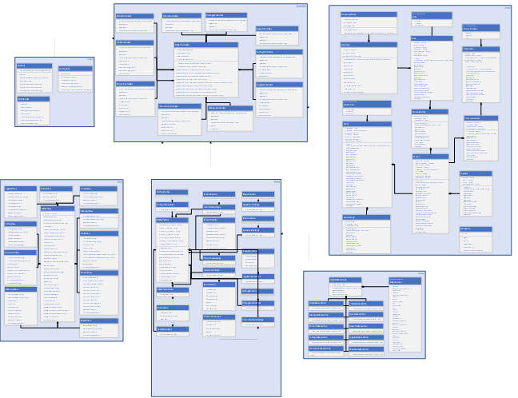
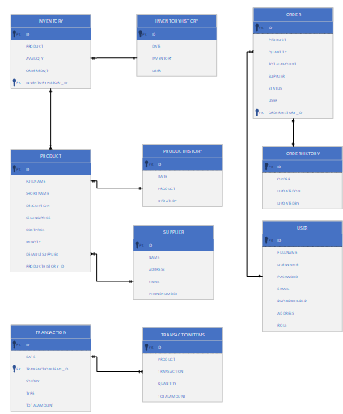

# MiNet 

## Build and Generate the JAR file (compile the source code)
```
# Git clone (download the source code)
$ git clone https://github.com/mallikaravi/MiNet.git
$ cd MiNet

# Build and Generate the JAR file (compile the source code)
$ mvn clean package install 
$ java -jar MiNet-0.0.1.jar  

# How to generate a jar file from Eclipse IDE
# launch Eclipse IDE >
   > Import project from local drive
   > Select pom.xml > Right Click > Run As > Run configuraions Dialog, Enter "clean package install" in Goals text box 
   > Select Run button

# Run the MiNet application, assets folder and jar file should be in same path.
.
├── ...
    ├──assets
    ├──MiNet-0.0.1.jar
```
# Table of Contents
<!--ts-->
   * [Prerequisites](#prerequisites)
   * [About](#about)
   * [Project SetUp](#project-setup)
   * [Implementation And Design](#implementation-and-design)
      * [Define a simple Maven Build](#define-a-simple-maven-build)
        * [Dependencies](#dependencies)
        * [UseCase Diagram](#usecase-diagram)
        * [Class Diagram](#class-diagram) 
        * [Entity Model Diagram](#entity-model-diagram)
   *  [Tool Used For Project Management](#tool-used-for-project-management)
   *  [Future Enhancement](#future-enhancement)

        
<!--te-->


Prerequisites
============
### - JDK 17.0.2
### - Maven [[Download](https://maven.apache.org/download.cgi) / [Install](https://maven.apache.org/install.html)]


About
============
MiNet is a terminal based application.it is a warehouse management system,where there are three roles in the application who creates products,orders,transactions.They should first login to the application and select their role.The three roles in the project are:

1. Admin
2. Manager
3. cashier

This application is used for performing various operations.The operations are done by three roles respectively according to their role.

1. Transaction
2. Products
3. Suppliers
4. Order
5. Payments
6. Cash Flow
7. Profits
8. Reports
9. Settings

NOTE: Product minimum quantity should be always one.
* ORDER: To create an order,Product should be out of stock.
* The ORDER shall be reviewed only by Admin and Manager
* Cashier shall have access to see only his created orders.

Project setup
============
First you’ll need to setup a Java project for Maven to build. 

Implementation and Design
============
Explained here 

https://github.com/mallikaravi/ATM/blob/main/design/MiNet-Design.pdf

### Usecase Diagram: 


### Class Diagram 



### Entity Model Diagram 


Technology
============
The following technologies are used in designing and developing the recipe manager application.

1. Java – Coding language for implementing the ATM application
2. Eclipse - IDE Purpose 
3. Microsoft Visio - UML Diagram tool
4. Maven - Building tool
5. Jackson API-Parsing and saving the models

Define a simple Maven Build
============
1.You need to create a Maven project definition.
2.Maven projects are defined with an XML file named pom.xml.
3.Among other things, this file gives the project’s name, version, and dependencies that it has on external libraries.
4.Create a file named pom.xml at the root of the project.

 Dependencies
============

```
	<dependencies>
		<dependency>
			<groupId>com.fasterxml.jackson.core</groupId>
			<artifactId>jackson-databind</artifactId>
			<version>${jackson.version}</version>
		</dependency>
		<dependency>
			<groupId>com.voodoodyne.jackson.jsog</groupId>
			<artifactId>jackson-jsog</artifactId>
			<version>${voodoodyne.version}</version>
			<scope>compile</scope>
		</dependency>
		<dependency>
			<groupId>org.junit.jupiter</groupId>
			<artifactId>junit-jupiter-engine</artifactId>
			<version>5.9.0</version>
			<scope>test</scope>
		</dependency>
	</dependencies>
```

This is the simplest possible pom.xml file necessary to build a Java project. It includes the following details of the project configuration:

*  modelVersion- POM model version (always 4.0.0).
*  groupId -  Group or organization that the project belongs to. Often expressed as an inverted domain name.
*  artifactId - Name to be given to the project’s library artifact (for example, the name of its JAR or WAR file).
*  version  -  Version of the project that is being built.

Tool used for project management
============
JIRA tool is used for this project, mainly maintaining the recipe-manager application backlogs. In sort following activities are done
- EPIC
- User stories
- Sprint handling
- etc.

### Link to JIRA Activities

Future Enhancement
============
* There should be different payment options for customers. If a user already has an account registered in the system, they can buy on credit, otherwise they have to pay by card or cash.

* Implement a commission-based system that gives the cashiers a certain percent of the sales the more they sell.

* Create list of related products where the user has the ability to sort them by best selling, cheapest, amount existing in the inventory or alphabetical order. The user may also want to filter the items by a certain price limit that the user enters.

* All error exceptions (runtime exceptions) and cashier-made transactions will be handled by separate threads, so that only one user at a time can write into a specific file, and once the file is closed it’s available for other users to use.


